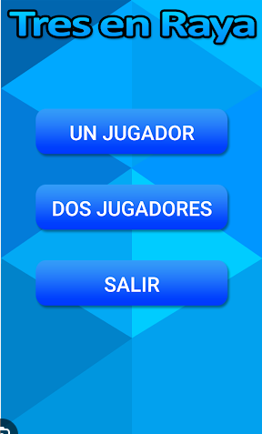

# Juego de 3 en Raya
    Prueba y diviertete jugando contra la IA o contra otro jugador al famoso juego de 3 en raya.
## Instrucciones

 - Antes de comenzar el juego, deberas de seleccionar una dificultad. En caso de que quieras jugar contra alguien en el mismo dispositivo debes de seleccionar la opcion de "2 jugadores".

 - Al comenzar el juego, comenzaras como el jugador "X" y la IA como el jugador "O". En caso de que juegues de forma local el otro jugador sera "O".

 - Si alguno de los jugadores consigue tener 3 "X" o 3 "O" consecutivas en vertical, horizontal o diagonal, ganara.

 - Cuando hayas terminado el juego, pulsas el boton "Reiniciar" para reiniciar el juego.

## Dificultades
    - Facil
    - Medio
    - Dificil
    - 2 Jugadores

## Lenguajes de Programacion

| Lenguajes     | IDE           |
| ------------- | ------------- |
| PHP           | Visual Studio |
| Javascript    | Visual Studio |
| HMTL          | Visual Studio |
| CSS            | Visual Studio |

## Visualizacion 



[Visita todos mis proyectos en mi GitHub](https://github.com/plaazaa03)

[Ademas de mi Linkedin](www.linkedin.com/in/raúl-plaza-gálvez-47b892253)

## Codigo Embebido De Ejemplo de Juego de 3 en Raya (Javascript)
```JavaScript
let tablero = new Array(9).fill(' ');

function dibujarTablero() {
    console.log(`${tablero[0]} | ${tablero[1]} | ${tablero[2]}`);
    console.log('---------');
    console.log(`${tablero[3]} | ${tablero[4]} | ${tablero[5]}`);
    console.log('---------');
    console.log(`${tablero[6]} | ${tablero[7]} | ${tablero[8]}`);
}

function verificarGanador() {
    const ganadores = [[0, 1, 2], [3, 4, 5], [6, 7, 8], [0, 3, 6], [1, 4, 7], [2, 5, 8], [0, 4, 8], [2, 4, 6]];
    for (const ganador of ganadores) {
        if (tablero[ganador[0]] === tablero[ganador[1]] && tablero[ganador[1]] === tablero[ganador[2]] && tablero[ganador[0]] !== ' ') {
            return true;
        }
    }
    return false;
}

function jugar() {
    let jugador = 'X';
    while (true) {
        dibujarTablero();
        const movimiento = prompt(`Jugador ${jugador}, ingresa tu movimiento (1-9): `);
        if (tablero[movimiento - 1] !== ' ') {
            console.log('Movimiento inválido, intenta de nuevo.');
            continue;
        }
        tablero[movimiento - 1] = jugador;
        if (verificarGanador()) {
            dibujarTablero();
            console.log(`Jugador ${jugador} ganaste!`);
            break;
        }

        if (jugador === 'X') {
            jugador = 'O';
        } else {
            jugador = 'X';
        }
    }
}

jugar();
```


